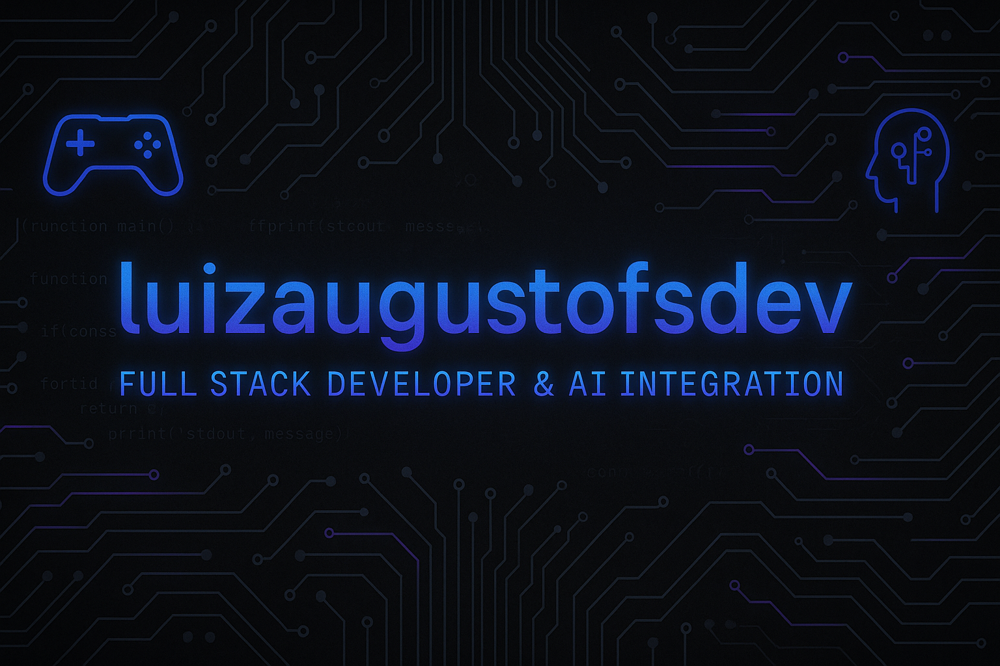

<!-- 🌟 Banner com estilo e título animado -->

  

<h1 align="center">
  
</h1>

---

<!-- 🧠 Badges de Tecnologias -->

  <!-- Principais linguagens -->
  
  
  
  

  <!-- Ferramentas e versionamento -->
  
  
  

  <!-- Temas de atuação -->
  
  
  

---

## 🚀 Sobre mim

- 🎖️ Profissional do Exército Brasileiro desde 2020 — experiência em gestão de pessoas, documentação, logística, armamentos, finanças e saúde.  
- 💻 Em transição para tecnologia com foco em **desenvolvimento Full Stack** e **integração de Inteligência Artificial**.  
- 📊 Estudando **Python, IoT, sensores, análise de dados, direito digital e propriedade intelectual**.  
- 🎮 Gamer de essência — acredito que criatividade + disciplina constroem soluções que funcionam.

---

## 🛠️ Tecnologias e Ferramentas

- **Linguagens:** Python, JavaScript (Node.js, React), HTML, CSS  
- **Tecnologias:** IoT, Programação de Sensores, Integração de APIs, Git  
- **Conceitos:** IA, Cibersegurança, Direito Digital & Propriedade Intelectual

---

## 📚 Formação & Cursos

- Análise de Dados com Python *(em andamento)*  
- IoT e Programação de Sensores *(em andamento)*  
- Direito Digital e Propriedade Intelectual *(em andamento)*  
- Tecnologias de Informação Aplicadas ao Direito — 60h  
- Direito Eletrônico — 60h  
- Direito Econômico — 60h  
- Mercado de Capitais — 60h  
- Finanças Pessoais e Investimentos — 180h  
- Coaching e Liderança — 80h  
- Educação Online — 20h  
- Inglês e Espanhol Intermediários

---

## 💎 Projetos em Destaque

### 🔹 Ultra Premium – Finanças e Dividendos
Planilha + Dashboard (Excel/Python) para acompanhar patrimônio, dividendos (estilo Barsi), metas e simulações com inflação/CDI.
  
[🔗 Repositório](https://github.com/luizaugustofsdev/ultra-premium-financas) • [📊 Demo (imgs)](#)  
 
 

---

### 🔹 Bot WhatsApp – Ações em Promoção
Bot que monitora mercado (B3) e envia candidatos a “preço bom” (screeners + filtros) direto no WhatsApp.
  
[🔗 Repositório](https://github.com/luizaugustofsdev/bot-whatsapp-acoes) • [▶️ Vídeo curto](#)  

---

### 🔹 Triunfo Sementes – Landing Page
Landing institucional com foco em proposta de valor, CTA e captação de leads.
  
[🌐 Demo](#) • [🔗 Repositório](https://github.com/luizaugustofsdev/triunfo-sementes-landing)  

---

### 🔹 OTT / Educação Física – Planos de Aula
Conjunto de planos de aula (Voleibol/Basquete) com foco em execução, avaliação e materiais.
  
[📄 PDF](#) • [🔗 Repositório](https://github.com/luizaugustofsdev/ott-planos-aula)  

---

## 🎯 Interesses Pessoais

- 🧠 **IA aplicada** a automação, copilots, análise de dados e educação (militar e civil).  
- 📈 **Investimentos** no estilo Barsi (dividendos), FIIs e portfolio trackers próprios.  
- 🔧 **Hardware/PC** (montagens high-end, resfriamento, diagnósticos e tunning).  
- 📡 **IoT & Sensores** integrando dados do mundo real em dashboards e APIs.  
- 🎮 **Games** e eSports: foco em performance, comunicação e trabalho em equipe.  
- 🌎 **Idiomas**: evolução contínua em Inglês e Espanhol para contexto tech/global.  
- 🧭 **Rotina, disciplina e liderança** — mindset militar aplicado a projetos tech.

---

## 📈 Estatísticas

  

---

## 🌍 Conecte-se comigo

- 💼 LinkedIn: [linkedin.com/in/luizaugustofsdev](https://linkedin.com/in/luizaugustofsdev)  
- 💻 GitHub: [github.com/luizaugustofsdev](https://github.com/luizaugustofsdev)  
- ✉️ Email: **luizaugustofsdev@gmail.com**
